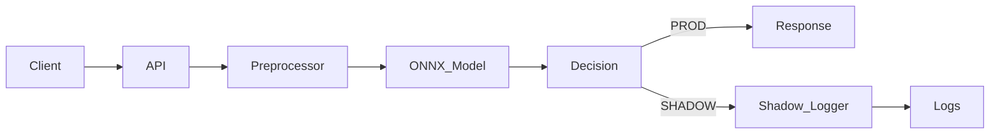

# Fraud Detection Engine

A production-style fraud detection inference service focused on low latency, safe model iteration, and operational clarity.

This repository demonstrates how a machine learning model is trained, optimized, deployed, and evaluated using patterns commonly used in large engineering organizations.

---

## High-Level Capabilities

* HTTP inference API
* ONNX Runtime for low-latency predictions
* Shadow mode for safe model evaluation
* Configurable fraud thresholds
* Docker + Gunicorn deployment
* Structured logging for observability

---

## Repository Structure

The following tree shows the repository layout with a brief description of each directory and file.

```text
.
├── app                         Application source code
│   ├── api                     HTTP API layer
│   │   └── v1                  API versioning
│   │       └── predict.py      Fraud prediction endpoint
│   ├── core                    Core configuration
│   │   └── config.py           Environment settings
│   ├── main.py                 Application entrypoint
│   ├── models                  Inference-related logic
│   │   ├── onnx_model.py       ONNX model loader
│   │   └── shadow.py           Shadow mode handling
│   ├── schemas                 Request/response schemas
│   │   └── transaction.py      Input validation
│   └── services                Business logic layer
│       └── inference.py        Inference execution
│
├── credit_card_transactions.csv    Sample transaction data
├── curl.txt                         Curl request examples
├── docker-compose.yml               Local orchestration
├── Dockerfile                       Container definition
│
├── docs                        System documentation
│   ├── api.md                  API reference
│   ├── architecture.md         System design
│   ├── data_contract.md        Input contract
│   ├── deployment.md           Deployment notes
│   ├── images                  Documentation assets
│   │   ├── end_to_end_latency_p95_local.png
│   │   ├── load_test_latency_results.png
│   │   ├── onnx_inference_latency_comparison.png
│   │   ├── predict_api_example_responses.png
│   │   └── shadow_mode_recall_comparison.png
│   ├── model.md                Model overview
│   ├── observability.md        Logging strategy
│   ├── shadow_mode.md          Shadow mode details
│   └── troubleshooting.md     Common issues
│
├── load_test                   Performance testing
│   ├── latency_test.py         Latency benchmark
│   └── load_test.py            Concurrent load
│
├── local_testing.md            Local test guide
│
├── ml                          Training pipeline
│   ├── benchmark.py            Inference benchmark
│   ├── convert_to_onnx.py      ONNX conversion
│   ├── datasets
│   │   └── credit_card_transactions.csv
│   ├── evaluate.py             Model evaluation
│   ├── preprocess.py           Feature processing
│   ├── train.py                Model training
│   └── verify_model.py         Artifact validation
│
├── models                      Deployed artifacts
│   ├── fraud_model.onnx        ONNX model
│   └── fraud_model.pkl         Pickle model
│
├── README.md                   Project overview
├── requirements.txt            Python dependencies
│
└── scripts                     Utility scripts
    └── generate_fraud_dataset.py
```

---

## Architecture Overview



---

## API Example

Endpoint: `POST /predict`

Detailed request and response formats:
[docs/api.md](docs/api.md)

Example response screenshots:
[docs/images/predict_api_example_responses.png](docs/images/predict_api_example_responses.png)

---

## Performance Evidence

ONNX inference latency comparison:
[docs/images/onnx_inference_latency_comparison.png](docs/images/onnx_inference_latency_comparison.png)

End-to-end p95 latency (local):
[docs/images/end_to_end_latency_p95_local.png](docs/images/end_to_end_latency_p95_local.png)

Load test results:
[docs/images/load_test_latency_results.png](docs/images/load_test_latency_results.png)

---

## Shadow Mode Validation

Shadow mode runs a candidate model in parallel without affecting production decisions.

* Predictions are logged
* Responses remain unchanged
* Recall improvements are measured offline

Recall comparison evidence:
[docs/images/shadow_mode_recall_comparison.png](docs/images/shadow_mode_recall_comparison.png)

Detailed explanation:
[docs/shadow_mode.md](docs/shadow_mode.md)

---

## Running Locally

Build and start the service:

```bash
docker compose up --build
```

Service URL:
[http://localhost:8000](http://localhost:8000)

Interactive API documentation:
[http://localhost:8000/docs](http://localhost:8000/docs)

---

## Configuration

Runtime behavior is controlled via environment variables.

See:
[.env.example](.env.example)

---

## License

MIT License
