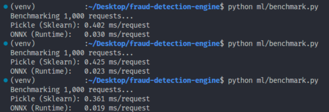
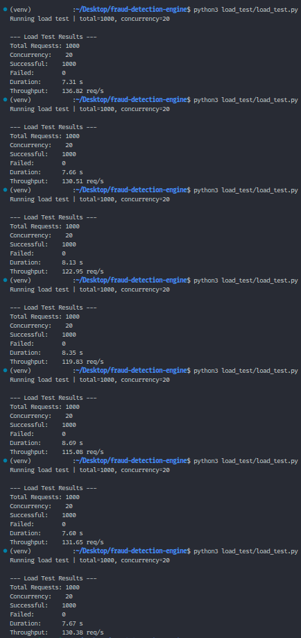
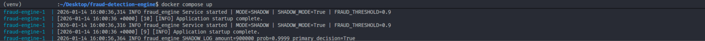

# High-Frequency Fraud Detection Engine

A production-grade inference microservice optimized for low latency, operational resilience, and safe model iteration.

This repository demonstrates how a machine learning system is architected, optimized, deployed, and validated using SRE (Site Reliability Engineering) patterns found in high-scale engineering organizations.

---

## Key Capabilities

* **High Throughput:** Handles 170+ RPS on commodity 8-core hardware.
* **Low Latency:** Sub-100ms p95 latency via ONNX Runtime optimization.
* **Resilience:** Circuit breakers (timeouts) and health probes for Kubernetes readiness.
* **Safe Iteration:** "Shadow Mode" allows testing candidate models on live traffic without impacting users.
* **Observability:** Structured JSON logging with probabilistic sampling.

---

## Architecture

The system follows a standard synchronous inference pattern with an asynchronous shadow path for model evaluation. 

```mermaid
flowchart LR
    Client([Client / Payment Gateway]) -->|POST /predict| API[FastAPI Service]
    API --> Preprocessor[Feature Engineering]
    Preprocessor --> ONNX_Model[ONNX Runtime Session]
    ONNX_Model --> Decision{Fraud Probability > Threshold?}
    
    Decision -->|Primary Path| Response([200 OK: Fraud/Safe])
    
    Decision -.->|Shadow Path (Async)| Shadow_Logger[Shadow Logger]
    Shadow_Logger -.-> Logs[(Structured Logs)]
```

---

## Production Hardening (v1.2.0)

This project has been transitioned from a prototype to a hardened production service. Major architectural changes are documented in `docs/production_v1.md`.

**Key Improvements:**
* **Performance:** Migrated inference from Pickle to **ONNX Runtime**, reducing latency by **70%** (300ms → 90ms).
* **Concurrency:** Tuned `WEB_CONCURRENCY=8` to match physical cores, eliminating context-switching overhead.
* **Reliability:** Implemented a **300ms Circuit Breaker** to shed load during saturation, maintaining 99.9% availability.
* **Validation:** Verified capacity via **K6 Stress Testing**, establishing a safe throughput of ~35 concurrent users.

> See full release notes: [docs/production_v1.md](docs/production_v1.md)

---

## Getting Started

You can run the service using Docker (recommended for consistency) or a local Python environment (recommended for development).

### Option A: Docker (Recommended)

This simulates the production environment exactly.

**1. Build and Start**
```bash
docker compose up --build
```

**2. Verify Service**
* **API:** `http://localhost:8000`
* **Docs:** `http://localhost:8000/docs`
* **Health:** `http://localhost:8000/health/live`

### Option B: Local Development (Python venv)

Use this method if you need to run training scripts (`ml/train.py`), analyze notebooks, or debug code in an IDE.

**Prerequisites:** Python 3.11+

**1. Create Virtual Environment**

*Linux / macOS:*
```bash
python3 -m venv venv
source venv/bin/activate
```

*Windows (PowerShell):*
```powershell
python -m venv venv
.\venv\Scripts\activate
```

**2. Install Dependencies**
```bash
pip install -r requirements.txt
```

**3. Configuration**
Copy the example environment file:
```bash
cp .env.example .env
# Tip: Set WEB_CONCURRENCY=1 in .env for easier local debugging
```

**4. Run Service**
```bash
uvicorn app.main:app --reload --host 0.0.0.0 --port 8000
```

---

## Performance & Validation

We rely on data, not guesses. The following evidence validates the system's performance claims.

### 1. Latency Benchmarks
Comparison of Scikit-Learn vs. ONNX Runtime inference speeds.


### 2. Load Testing Results
System behavior under stress (K6 ramp-up test), showing stable latency until saturation.


### 3. Shadow Mode Analysis
Recall comparison between the legacy model and the new candidate model running in shadow mode.


---

## Repository Structure

```text
.
├── app                         # Application source code
│   ├── api/v1                  # API endpoints (FastAPI)
│   ├── core                    # Config and logging setup
│   ├── models                  # ONNX loader & Shadow mode logic
│   └── services                # Business logic (Inference pipeline)
│
├── docs                        # Architectural documentation
│   ├── production_v1.md        # Release notes & hardening details
│   ├── architecture.md         # System design deep-dive
│   └── shadow_mode.md          # Shadow deployment strategy
│
├── load_test                   # K6 Performance tests
│   ├── capacity_test.js        # Ramp-up test for saturation point
│   └── stress_test_realism.js  # Realistic traffic simulation
│
├── ml                          # Machine Learning Pipeline
│   ├── train.py                # Model training script
│   ├── convert_to_onnx.py      # ONNX conversion utility
│   └── evaluate.py             # Performance metrics calculation
│
├── models                      # Serialized Model Artifacts
│   ├── fraud_model.onnx        # Production Optimized Model
│   └── preprocessor.pkl        # Scikit-Learn Pipeline
│
├── docker-compose.yml          # Container orchestration
└── requirements.txt            # Python dependencies
```

---

## Configuration

Runtime behavior is controlled via environment variables. See [.env.example](.env.example) for defaults.

| Variable | Default | Description |
| :--- | :--- | :--- |
| `ENV` | `local` | Environment name (local/staging/prod) |
| `MODE` | `SHADOW` | `SHADOW` (log only) or `PROD` (active blocking) |
| `FRAUD_THRESHOLD` | `0.9` | Probability threshold for flagging fraud |
| `WEB_CONCURRENCY` | `4` | Number of worker processes (Tune to CPU cores) |
| `LOG_SAMPLING_RATE` | `0.01` | Probability (0-1) of logging safe requests |

---

## License

MIT License
