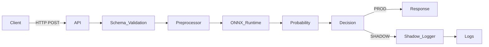

# Architecture

This document describes the runtime architecture of the fraud detection service.

The design prioritizes low latency, clear separation of concerns, and safe model iteration.

---

## High-Level Overview

The service exposes a single HTTP endpoint that accepts transaction data and returns a fraud decision.

At runtime, the system consists of:

* HTTP API layer
* Preprocessing pipeline
* Model inference engine
* Decision layer
* Optional shadow evaluation logic

---

## Request Flow

---

## Component Responsibilities

### API Layer

* Handles HTTP requests
* Performs input validation
* Contains no business logic

Implemented using FastAPI.

---

### Preprocessing Layer

* Transforms raw request data into model-ready features
* Loaded once at application startup
* Shared across all requests

---

### Inference Layer

* Executes model inference using ONNX Runtime
* Uses a preloaded model session
* Optimized for low latency

---

### Decision Layer

* Applies a threshold to the model probability
* Determines the final fraud classification
* Threshold is configurable via environment variables

---

### Shadow Mode

* Executes the same inference path
* Logs predictions and decisions
* Does not impact the API response

Shadow mode is used for offline analysis and validation.

---

## Configuration Management

All runtime behavior is controlled using environment variables.

Configuration includes:

* Environment name
* Fraud decision threshold
* Shadow mode toggle
* Web server concurrency

No configuration is hard-coded.

---

## Concurrency Model

* The service runs under Gunicorn
* Uses Uvicorn worker processes
* Each worker loads its own model and preprocessing pipeline
* Requests are handled independently and statelessly

---

## Non-Goals

This architecture does not attempt to:

* Persist request data
* Perform online learning
* Provide real-time feature aggregation
* Integrate with external data stores

These concerns are intentionally out of scope.

---

## Summary

The architecture favors simplicity and operational clarity.

Model experimentation is isolated from production decision-making.
